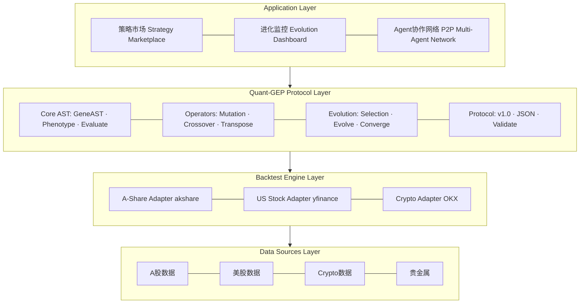
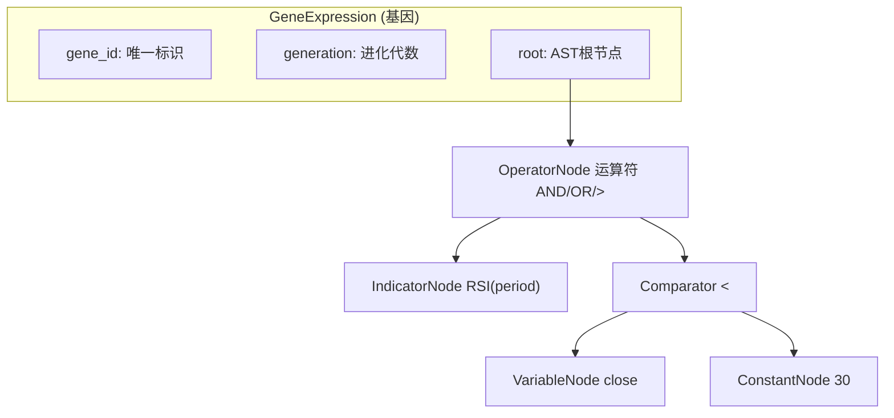
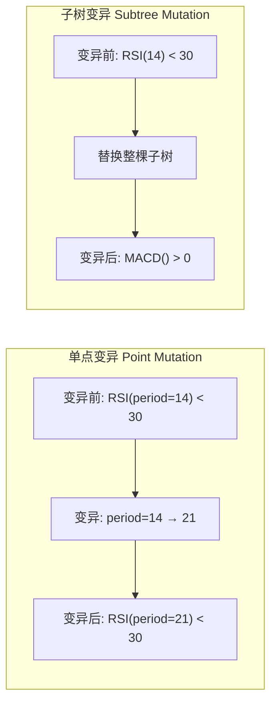
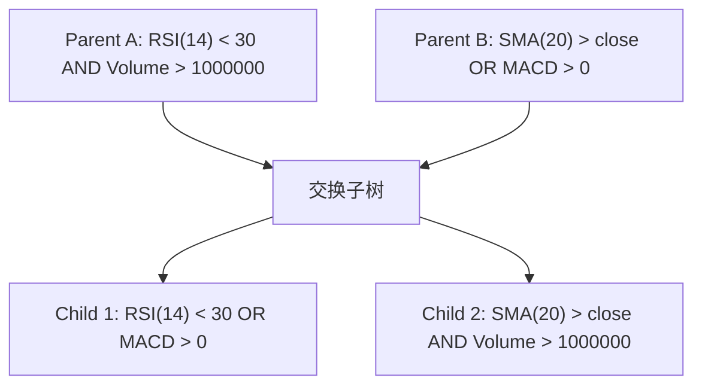
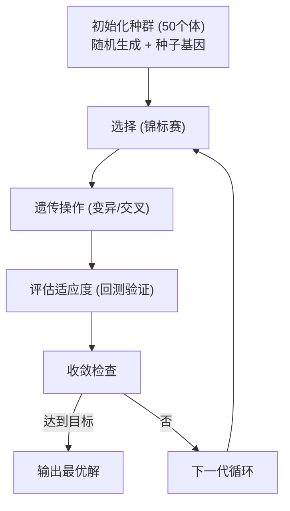
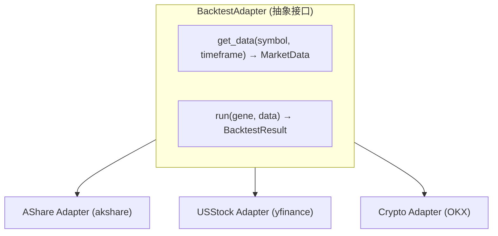
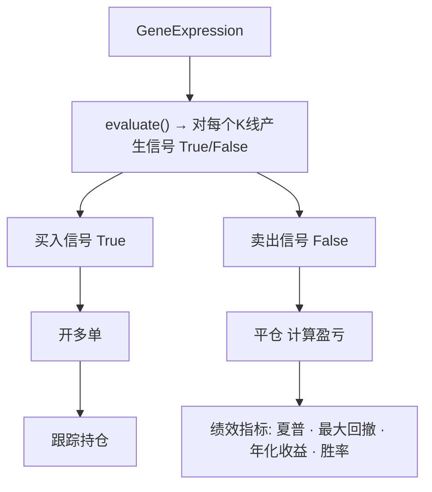
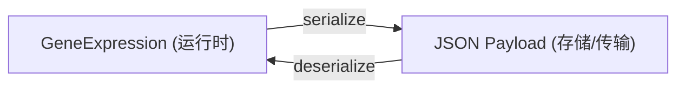
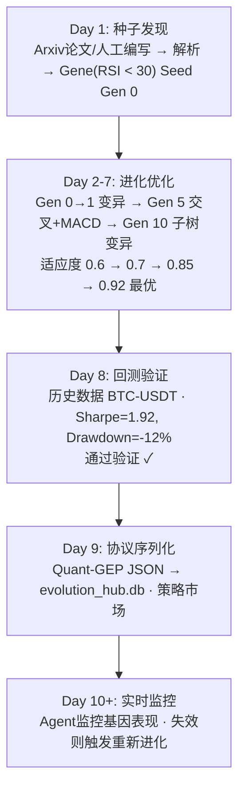

# Quant-GEP Protocol v1.0

> **Gene Expression Programming for Quantitative Trading**
> 
> 行业级量化交易GEP协议实现 - 针对金融市场的进化计算框架

---

## 📋 目录

1. [系统概述](#系统概述)
2. [核心架构](#核心架构)
3. [模块详解](#模块详解)
4. [运作机制](#运作机制)
5. [使用示例](#使用示例)
6. [API参考](#api参考)
7. [文件结构](#文件结构)

---

## 系统概述

### 什么是Quant-GEP？

Quant-GEP (Gene Expression Programming for Quantitative Trading) 是专门为量化交易场景设计的基因表达式编程协议实现。它将生物进化原理应用于交易策略的自动发现、优化和验证。

### 核心特性

| 特性 | 说明 |
|------|------|
| 🧬 **AST基因表达** | 树形结构表示策略，支持Genotype/Phenotype分离 |
| 🔄 **完整GEP算子** | 变异、交叉、转位、反转、选择算子 |
| 📊 **标准化回测** | 统一A股/美股/Crypto多市场回测接口 |
| 🌐 **协议标准化** | quant-gep-v1 Schema，支持版本控制和向后兼容 |
| 🤖 **多Agent协作** | P2P网络支持任务分发和结果聚合 |

### 与EvoMap的关系

Quant-GEP是EvoMap概念在量化交易领域的特化实现：
- **EvoMap**: 通用AI Agent技能进化基础设施
- **Quant-GEP**: 专注量化策略的基因表达式编程协议

---

## 核心架构



---

## 模块详解

### 1. Core - AST基因表达式

**文件**: `quant_gep/core/gene_ast.py`

#### 1.1 核心概念



#### 1.2 节点类型

| 节点类型 | 类名 | 用途 | 示例 |
|---------|------|------|------|
| **运算符** | `OperatorNode` | 逻辑/算术运算 | `AND`, `OR`, `>`, `<` |
| **技术指标** | `IndicatorNode` | 计算技术指标 | `RSI(14)`, `SMA(20)` |
| **常数** | `ConstantNode` | 数值常量 | `30`, `0.05` |
| **变量** | `VariableNode` | 价格/成交量 | `close`, `volume` |

#### 1.3 Genotype ↔ Phenotype

```python
# Genotype (基因型) - 可进化/变异的树形结构
gene = GeneExpression(root=ast_tree)

# Phenotype (表现型) - 在市场数据上执行产生信号
context = MarketContext(close=100, high=105, low=98, ...)
signal = gene.evaluate(context)  # True = 买入, False = 卖出
```

---

### 2. Operators - GEP进化算子

**文件**: `quant_gep/operators/__init__.py`

#### 2.1 变异算子 (Mutation)



#### 2.2 交叉算子 (Crossover)



#### 2.3 转位算子 (Transposition)

| 算子 | 描述 | 效果 |
|------|------|------|
| **IS转位** | 插入序列到随机位置 | 添加新条件到AND节点 |
| **RIS转位** | 根插入转位 | 新增顶层OR条件 |
| **基因转位** | 整个基因移位 | 大规模结构变化 |

#### 2.4 选择算子 (Selection)

```python
# 锦标赛选择
winner = selection.tournament_selection(population, fitness_scores, k=3)

# 轮盘赌选择
winner = selection.roulette_selection(population, fitness_scores);

# 精英保留
elites = selection.elitism_selection(population, fitness_scores, count=2)
```

---

### 3. Evolution - 进化算法

**文件**: `quant_gep/evolution/__init__.py`

#### 3.1 GEPAlgorithm工作流程



#### 3.2 适应度评估流程

```python
def fitness_fn(gene: GeneExpression) -> FitnessResult:
    # 1. 获取历史数据
    data = adapter.get_data("BTC-USDT", timeframe="1h", limit=1000)
    
    # 2. 执行回测
    result = adapter.run(gene, data)
    
    # 3. 计算综合适应度
    fitness = (
        result.sharpe_ratio * 0.4 +          # 夏普权重40%
        (1 - result.max_drawdown) * 0.3 +    # 回撤权重30%
        result.win_rate * 0.2 +              # 胜率权重20%
        min(result.total_trades / 100, 1) * 0.1  # 交易次数10%
    )
    
    return FitnessResult(
        fitness=fitness,
        sharpe_ratio=result.sharpe_ratio,
        max_drawdown=result.max_drawdown,
        ...
    )
```

---

### 4. Backtest - 标准化回测

**文件**: `quant_gep/backtest/__init__.py`

#### 4.1 回测架构



#### 4.2 回测执行流程



#### 4.3 绩效指标

| 指标 | 说明 | 计算公式 |
|------|------|----------|
| **Sharpe Ratio** | 风险调整收益 | (Rp - Rf) / σp |
| **Max Drawdown** | 最大回撤 | max(peak - trough) / peak |
| **Annual Return** | 年化收益 | (1 + total_return)^(365/days) - 1 |
| **Win Rate** | 胜率 | wins / total_trades |
| **Profit Factor** | 盈亏比 | gross_profit / gross_loss |
| **Calmar Ratio** | Calmar比率 | annual_return / max_drawdown |

---

### 5. Protocol - 标准Schema

**文件**: `quant_gep/protocol/__init__.py`

#### 5.1 Quant-GEP v1.0 Schema

```json
{
  "schema_version": "quant-gep-v1",
  "protocol_version": "1.0.0",
  "gene_id": "abc123def4567890",
  "name": "RSI_Mean_Reversion",
  "ast": {
    "node_type": "OPERATOR",
    "value": "AND",
    "children": [
      {
        "node_type": "COMPARATOR",
        "value": "<",
        "children": [
          {
            "node_type": "INDICATOR",
            "indicator": "RSI",
            "parameters": {"period": 14}
          },
          {
            "node_type": "CONSTANT",
            "value": 30
          }
        ]
      }
    ]
  },
  "lineage": {
    "parent_ids": ["parent_gene_001"],
    "mutation_type": "point",
    "generation": 5
  },
  "validation": {
    "status": "validated",
    "sharpe_ratio": 1.85,
    "max_drawdown": -0.15,
    "annual_return": 0.35,
    "win_rate": 0.62,
    "total_trades": 150,
    "test_symbols": ["BTC-USDT"],
    "test_period": "2020-01-01/2024-01-01"
  },
  "meta": {
    "author": "QuantClaw-Agent-001",
    "created_at": "2026-02-25T12:00:00Z",
    "source": "mutation",
    "tags": ["rsi", "mean_reversion", "crypto"],
    "description": "RSI超卖买入策略，经GEP进化优化"
  }
}
```

#### 5.2 数据流向



应用场景:
- 数据库存储 (SQLite/PostgreSQL)
- 网络传输 (P2P Agent通信)
- 策略市场 (买卖策略)
- 版本控制 (Git-like进化历史)

---

## 运作机制

### 完整工作流



---

## 使用示例

### 示例1: 创建基因

```python
from quant_gep import *

# 方法1: 使用快捷函数
gene1 = create_buy_signal(IndicatorType.RSI, threshold=30, condition="<")
print(gene1.to_formula())  # RSI(period=14) < 30

# 方法2: 创建均线金叉信号
gene2 = create_crossover_signal(fast_period=20, slow_period=60)
print(gene2.to_formula())  # SMA(period=20) > SMA(period=60)

# 方法3: 手动构建复杂基因
root = OperatorNode(Operator.AND)

# 条件1: RSI < 30
rsi = IndicatorNode(IndicatorType.RSI, {"period": 14})
threshold1 = ConstantNode(30)
cond1 = OperatorNode(Operator.LT)
cond1.add_child(rsi)
cond1.add_child(threshold1)

# 条件2: 成交量 > 100万
volume = VariableNode("volume")
threshold2 = ConstantNode(1000000)
cond2 = OperatorNode(Operator.GT)
cond2.add_child(volume)
cond2.add_child(threshold2)

root.add_child(cond1)
root.add_child(cond2)

gene3 = GeneExpression(root=root, gene_id="custom_001")
print(gene3.to_formula())  # (RSI(period=14) < 30) AND (volume > 1000000)
```

### 示例2: 进化优化

```python
from quant_gep import *

# 配置
config = GEPConfig(
    mutation_rate=0.1,
    crossover_rate=0.7,
    max_depth=8
)

# 创建算法实例
algo = GEPAlgorithm(config)

# 种子基因
seed = create_buy_signal(IndicatorType.RSI, 30)
population = algo.initialize_population(size=20, seed_genes=[seed])

# 定义适应度函数
def fitness_fn(gene) -> FitnessResult:
    # 这里应调用真实回测，使用模拟数据
    complexity = gene.get_complexity()
    fitness = 1.0 / (1 + abs(complexity - 10))
    
    return FitnessResult(
        fitness=fitness,
        sharpe_ratio=fitness * 2,
        max_drawdown=-0.1 * gene.get_depth(),
        annual_return=fitness * 0.5
    )

# 执行进化
final_pop, history = algo.evolve(
    population=population,
    fitness_fn=fitness_fn,
    generations=10,
    callback=lambda s: print(f"Gen {s.generation}: best={s.best_fitness:.4f}")
)

# 获取最优基因
final_fitness = [fitness_fn(g).fitness for g in final_pop]
best_idx = final_fitness.index(max(final_fitness))
best_gene = final_pop[best_idx]
print(f"最优基因: {best_gene.to_formula()}")
```

### 示例3: 回测验证

```python
from quant_gep import *

# 创建测试基因
gene = create_buy_signal(IndicatorType.RSI, 30)

# 执行快速回测
result = quick_backtest(
    gene=gene,
    symbol="BTC-USDT",
    market_type=MarketType.CRYPTO,
    timeframe=TimeFrame.H1
)

print(f"总交易数: {result.total_trades}")
print(f"胜率: {result.win_rate:.2%}")
print(f"年化收益: {result.annual_return:.2%}")
print(f"最大回撤: {result.max_drawdown:.2%}")
print(f"夏普比率: {result.sharpe_ratio:.2f}")
print(f"盈亏比: {result.profit_factor:.2f}")
```

### 示例4: 协议序列化

```python
from quant_gep import *
import json

# 创建基因
gene = create_crossover_signal(20, 60)
gene.gene_id = "test_gene_001"
gene.generation = 5

# 序列化为Quant-GEP格式
payload = serialize_gene(
    gene=gene,
    validation=ValidationInfo(
        status=ValidationStatus.VALIDATED,
        sharpe_ratio=1.85,
        max_drawdown=-0.12,
        annual_return=0.35,
        win_rate=0.62,
        total_trades=150
    ),
    meta=Metadata(
        author="QuantClaw-AI",
        source=GeneSource.CROSSOVER,
        tags=["sma", "trend_following", "crypto"],
        description="20/60日均线金叉策略，经GEP进化优化"
    )
)

# 保存到文件
with open("strategy.json", "w") as f:
    json.dump(payload, f, indent=2)

# 反序列化
restored = deserialize_gene(payload)
print(f"恢复成功: {restored.to_formula()}")
```

---

## API参考

### Core API

| 函数/类 | 描述 | 参数 | 返回值 |
|---------|------|------|--------|
| `GeneExpression` | 基因表达式类 | `root`, `gene_id`, `generation` | GeneExpression |
| `create_buy_signal()` | 创建买入信号 | `indicator`, `threshold`, `condition` | GeneExpression |
| `create_crossover_signal()` | 创建金叉信号 | `fast_period`, `slow_period` | GeneExpression |
| `GeneASTNode.evaluate()` | 执行基因 | `context: MarketContext` | bool/float |
| `GeneExpression.to_formula()` | 转字符串 | - | str |
| `GeneExpression.to_dict()` | 序列化 | - | dict |

### Operators API

| 类 | 描述 | 主要方法 |
|----|------|---------|
| `PointMutation` | 单点变异 | `mutate(gene) -> GeneExpression` |
| `SubtreeMutation` | 子树变异 | `mutate(gene) -> GeneExpression` |
| `OnePointCrossover` | 单点交叉 | `crossover(p1, p2) -> (c1, c2)` |
| `TranspositionOperator` | 转位算子 | `is_transposition(gene)` |
| `SelectionOperator` | 选择算子 | `tournament_selection(...)` |

### Evolution API

| 类 | 描述 | 主要方法 |
|----|------|---------|
| `GEPAlgorithm` | 主进化算法 | `evolve(population, fitness_fn, ...)` |
| `GEPConfig` | 配置类 | 各种概率参数 |
| `FitnessResult` | 适应度结果 | fitness, sharpe_ratio, ... |
| `EvolutionStats` | 进化统计 | generation, best_fitness, ... |

### Backtest API

| 函数/类 | 描述 | 参数 |
|---------|------|------|
| `quick_backtest()` | 快速回测 | `gene, symbol, market_type` |
| `create_adapter()` | 创建适配器 | `market_type` |
| `BacktestResult` | 回测结果 | 各种绩效指标 |
| `MarketData` | 市场数据 | OHLCV序列 |

### Protocol API

| 函数 | 描述 | 参数 |
|------|------|------|
| `serialize_gene()` | 序列化 | `gene, validation, meta` |
| `deserialize_gene()` | 反序列化 | `payload` |
| `gene_to_json()` | 转JSON | `gene` |
| `gene_from_json()` | 从JSON恢复 | `json_str` |

---

## 文件结构

```
quantclaw/quant_gep/
├── __init__.py              # 统一入口，导出所有API
├── examples.py              # 使用示例代码
│
├── core/
│   └── gene_ast.py          # AST基因表达式 (470行)
│       ├── GeneASTNode      # 节点基类
│       ├── GeneExpression   # 基因表达式
│       ├── OperatorNode     # 运算符节点
│       ├── IndicatorNode    # 指标节点
│       ├── ConstantNode     # 常数节点
│       ├── VariableNode     # 变量节点
│       └── MarketContext    # 市场上下文
│
├── operators/
│   └── __init__.py          # GEP进化算子 (420行)
│       ├── GEPConfig        # 配置类
│       ├── PointMutation    # 单点变异
│       ├── SubtreeMutation  # 子树变异
│       ├── OnePointCrossover # 单点交叉
│       ├── TranspositionOperator # 转位算子
│       ├── InversionOperator # 反转算子
│       ├── SelectionOperator # 选择算子
│       └── RandomTreeGenerator # 随机树生成
│
├── evolution/
│   └── __init__.py          # 进化算法 (290行)
│       ├── GEPAlgorithm     # 主进化算法
│       ├── MultiObjectiveGEP # 多目标进化
│       ├── FitnessResult    # 适应度结果
│       └── EvolutionStats   # 进化统计
│
├── backtest/
│   └── __init__.py          # 标准化回测 (390行)
│       ├── BacktestAdapter  # 回测适配器基类
│       ├── SimpleBacktestEngine # 简单回测引擎
│       ├── AShareAdapter    # A股适配器
│       ├── USStockAdapter   # 美股适配器
│       ├── CryptoAdapter    # 加密货币适配器
│       ├── MarketData       # 市场数据结构
│       ├── BacktestResult   # 回测结果
│       └── TimeFrame        # 时间框架枚举
│
├── protocol/
│   └── __init__.py          # Protocol Schema (470行)
│       ├── QuantGEPSchema   # 序列化器
│       ├── LineageInfo      # 血统信息
│       ├── ValidationInfo   # 验证信息
│       ├── Metadata         # 元数据
│       ├── ValidationStatus # 验证状态枚举
│       ├── GeneSource       # 基因来源枚举
│       └── MutationType     # 变异类型枚举
│
└── api/
    └── __init__.py          # API服务器 (100行)
        ├── GEPAPI           # API封装类
        └── create_standard_endpoints # 端点创建

总计: ~2969行代码，8个核心文件
```

---

## 版本信息

- **协议版本**: quant-gep-v1
- **实现版本**: 1.0.0
- **发布日期**: 2026-02-25
- **作者**: QuantClaw
- **许可证**: MIT

---

## 相关资源

- **EvoMap**: https://evomap.ai
- **Gene Expression Programming**: 参考Ferreira (2001) GEP经典论文
- **QuantClaw**: 完整量化交易系统

---

*本文档由 Quant-GEP v1.0 自动生成*
